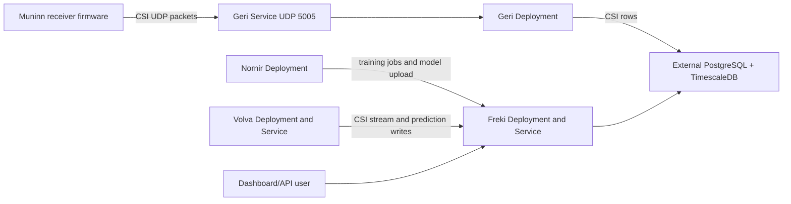

# Grimnir Helm Chart

This chart installs the Grimnir home Wi-Fi CSI localization stack on Kubernetes:

- Geri UDP packet ingress and TimescaleDB writer.
- Freki dashboard, REST API, SSE streams, and metrics.
- Nornir training daemon.
- Volva live inference service.

The following diagram shows the chart-managed workloads and the external systems
they depend on:



In text form, the chart exposes Geri for receiver UDP traffic, runs Freki for the
dashboard/API, runs Nornir and Volva as internal HTTP clients of Freki, and uses
an external TimescaleDB-backed PostgreSQL database for persistent state.

The chart is published to the GHCR OCI registry:

```bash
helm show chart oci://ghcr.io/dannysauer/charts/grimnir
```

## Prerequisites

- Kubernetes cluster with a load-balancer path that ESP32 Muninn receivers can
  reach on UDP port 5005.
- PostgreSQL with TimescaleDB. The chart does not install a database.
- Container image pull access to `ghcr.io/dannysauer/grimnir/*`.
- Optional Prometheus Operator CRDs when `prometheus.serviceMonitor.enabled` is
  set.
- Optional Vertical Pod Autoscaler CRDs when `vpa.enabled` is set.
- Optional Grafana sidecar support when `grafana.dashboard.enabled` is set.

Install TimescaleDB before starting Grimnir when possible. The runtime database
role should not remain a superuser in a long-running deployment.

## Install

Install from the published OCI chart:

```bash
CHART_VERSION=0.1.1
helm install grimnir oci://ghcr.io/dannysauer/charts/grimnir \
  --version "$CHART_VERSION" \
  --set database.url="postgresql+asyncpg://csi_user@db.example.com:5432/csi"
```

The example URL omits a password. Use a credential-bearing URL in your local
shell, uncommitted values file, or Kubernetes Secret.

For shared clusters, prefer a pre-created Secret instead of putting credentials
in Helm values:

```bash
CHART_VERSION=0.1.1
kubectl create secret generic grimnir-db \
  --from-literal=DATABASE_URL="postgresql+asyncpg://csi_user@db.example.com:5432/csi"

helm install grimnir oci://ghcr.io/dannysauer/charts/grimnir \
  --version "$CHART_VERSION" \
  --set database.existingSecret=grimnir-db
```

## Upgrade

```bash
CHART_VERSION=0.1.1
helm upgrade grimnir oci://ghcr.io/dannysauer/charts/grimnir \
  --version "$CHART_VERSION" \
  --reuse-values
```

Check rollout and health after upgrading:

```bash
kubectl rollout status deployment/grimnir-freki
kubectl rollout status deployment/grimnir-geri
kubectl rollout status deployment/grimnir-nornir
kubectl rollout status deployment/grimnir-volva
kubectl port-forward svc/grimnir-freki 8000:8000
curl -fsS http://127.0.0.1:8000/health
```

## Uninstall

```bash
helm uninstall grimnir
```

The uninstall removes Kubernetes resources created by the chart. It does not
delete the external database, database credentials, load-balancer DNS records, or
firmware configuration.

## Values

The chart validates values with `values.schema.json`. Run local validation from
the repository root:

```bash
helm lint bifrost/helm/grimnir \
  --set database.url="postgresql+asyncpg://csi_user@db.example.com:5432/csi"

helm template grimnir bifrost/helm/grimnir \
  --set database.url="postgresql+asyncpg://csi_user@db.example.com:5432/csi"
```

Common values:

| Value | Default | Description |
|-------|---------|-------------|
| `image.geri.repository` | `ghcr.io/dannysauer/grimnir/geri` | Geri image repository. |
| `image.geri.tag` | `""` | Geri image tag; defaults to `Chart.appVersion`. |
| `image.freki.repository` | `ghcr.io/dannysauer/grimnir/freki` | Freki image repository. |
| `image.freki.tag` | `""` | Freki image tag; defaults to `Chart.appVersion`. |
| `image.nornir.repository` | `ghcr.io/dannysauer/grimnir/nornir` | Nornir image repository. |
| `image.nornir.tag` | `""` | Nornir image tag; defaults to `Chart.appVersion`. |
| `image.volva.repository` | `ghcr.io/dannysauer/grimnir/volva` | Volva image repository. |
| `image.volva.tag` | `""` | Volva image tag; defaults to `Chart.appVersion`. |
| `imagePullSecrets` | `[]` | Image pull secrets added to all pods. |
| `revisionHistoryLimit` | `3` | Old ReplicaSets retained per deployment. |
| `database.url` | `""` | PostgreSQL URL using the `postgresql+asyncpg://` driver. Required unless `database.existingSecret` is set. |
| `database.existingSecret` | `""` | Existing Secret containing the database URL. |
| `database.secretKey` | `DATABASE_URL` | Key in the database Secret. |
| `modelUploadAuth.sharedSecret` | `""` | Optional shared secret for `POST /api/models`; creates a Secret when set. |
| `modelUploadAuth.existingSecret` | `""` | Existing Secret for model upload auth. |
| `modelUploadAuth.secretKey` | `MODEL_UPLOAD_SHARED_SECRET` | Key for model upload auth. |
| `mlControlAuth.sharedSecret` | `""` | Optional shared secret for Nornir daemon and job-control writes. |
| `mlControlAuth.existingSecret` | `""` | Existing Secret for ML control auth. |
| `mlControlAuth.secretKey` | `ML_CONTROL_SHARED_SECRET` | Key for ML control auth. |
| `geri.replicaCount` | `1` | Geri replicas. UDP load-balancing should keep each sender on one pod. |
| `geri.service.type` | `LoadBalancer` | Service type for Muninn UDP ingress. |
| `geri.service.port` | `5005` | UDP port exposed by the service. |
| `geri.service.loadBalancerIP` | `""` | Optional fixed LoadBalancer IP; omitted when empty. |
| `geri.service.externalTrafficPolicy` | `Local` | Preserves receiver source IPs for heartbeat records. |
| `geri.service.annotations` | `{}` | Service annotations, commonly MetalLB and external-dns. |
| `geri.env` | See `values.yaml` | Extra Geri environment variables such as `BATCH_SIZE`, `BATCH_TIMEOUT_MS`, `LOG_LEVEL`, and `METRICS_PORT`. |
| `freki.replicaCount` | `1` | Freki replicas. Current prediction state is stored in Postgres. |
| `freki.service.type` | `ClusterIP` | Freki service type. |
| `freki.service.port` | `8000` | Freki HTTP port. |
| `freki.ingress.enabled` | `false` | Create an Ingress for dashboard and API access. |
| `freki.ingress.className` | `""` | Optional ingress class. |
| `freki.ingress.hosts` | `grimnir.example.com` | Ingress hosts and paths. |
| `freki.ingress.tls` | `[]` | Optional TLS entries. |
| `freki.livenessProbe` | See `values.yaml` | Freki liveness probe timing. |
| `freki.readinessProbe` | See `values.yaml` | Freki readiness probe timing. |
| `freki.env` | See `values.yaml` | Extra Freki environment variables. |
| `nornir.replicaCount` | `1` | Nornir replicas. Job claims are race-safe. |
| `nornir.service.port` | `8001` | Nornir metrics service port. |
| `nornir.env` | See `values.yaml` | Nornir polling, heartbeat, metrics, and logging variables. |
| `volva.replicaCount` | `1` | Volva replicas. Keep at one writer for current predictions. |
| `volva.service.port` | `8002` | Volva health and metrics service port. |
| `volva.livenessProbe` | See `values.yaml` | Volva liveness probe timing. |
| `volva.readinessProbe` | See `values.yaml` | Volva readiness probe timing. |
| `volva.env` | See `values.yaml` | Volva model refresh, windowing, and logging variables. |
| `vpa.enabled` | `false` | Create VPA resources for all workloads. |
| `vpa.updateMode` | `Off` | VPA update mode. Start with `Off` for recommendations only. |
| `prometheus.serviceMonitor.enabled` | `false` | Create ServiceMonitor resources. |
| `prometheus.serviceMonitor.namespace` | `""` | ServiceMonitor namespace; defaults to release namespace. |
| `prometheus.serviceMonitor.labels` | `{}` | Extra labels for Prometheus Operator selection. |
| `grafana.dashboard.enabled` | `false` | Create a dashboard ConfigMap for a Grafana sidecar. |
| `grafana.dashboard.folder` | `Grimnir` | Grafana dashboard folder annotation. |

## Geri Load Balancer

Muninn firmware sends UDP packets to `AGGREGATOR_HOST` on port 5005. Point that
hostname at the Geri load balancer address.

Example MetalLB and external-dns annotations:

```yaml
geri:
  service:
    annotations:
      metallb.universe.tf/address-pool: default
      external-dns.alpha.kubernetes.io/hostname: csi-aggregator.home.example.com
```

Use `geri.service.loadBalancerIP` only when your cluster still relies on
`spec.loadBalancerIP`. Leave it empty to omit the field.

## Security Notes

- Freki does not provide broad dashboard or API authentication yet. Do not expose
  it beyond a trusted network without an ingress, gateway, or reverse proxy that
  adds HTTPS and authentication.
- Use `existingSecret` values for database URLs and shared secrets on shared
  clusters.
- `MODEL_UPLOAD_SHARED_SECRET` protects model upload writes when configured.
- `ML_CONTROL_SHARED_SECRET` protects Nornir daemon and job-control writes when
  configured.
- The workloads do not call the Kubernetes API. The chart does not create RBAC
  resources or dedicated service accounts.
- Pods run as non-root UID 1000, disallow privilege escalation, and use
  read-only root filesystems.

## Observability

Geri and Nornir expose metrics on dedicated metrics ports. Freki and Volva
expose metrics on their HTTP service ports. Enable ServiceMonitors when a
Prometheus Operator installation should scrape the services:

```yaml
prometheus:
  serviceMonitor:
    enabled: true
```

Enable the dashboard ConfigMap only when Grafana has a sidecar watching the
configured label:

```yaml
grafana:
  dashboard:
    enabled: true
```

## More Documentation

- [Deployment guide](../../../docs/deployment.md)
- [API reference](../../../docs/api-reference.md)
- [UDP wire protocol](../../../docs/udp-wire-protocol.md)
- [Firmware build and flash guide](../../../docs/firmware-build-and-flash.md)
